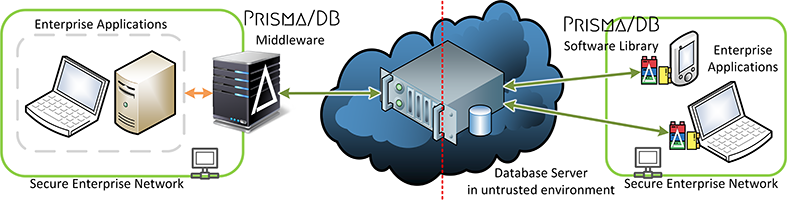

# Prisma/DB

Welcome to the Prisma/DB wiki! This wiki aims to help you understand and use Prisma/DB.

Supported SQL queries and commands are described in this wiki, together with its explanation and examples. Any other valid SQL queries will be executed at the actual database directly without passing through the transformative core encryption module.

## Introduction

Aprismatic's Prisma/DB is a secure data management and processing platform with a primary focus on data confidentiality. Exposing rich querying capabilities, precise encryption controls and high performance, it guarantees confidentiality of stored and processed data even if the storage infrastructure is compromised. Prisma/DB is a result of years of meticulous research done within Cyber Security Lab of Nanyang Technological University, Singapore. Even in case of an attacker gaining full control over the data infrastructure, the data is protected by strong cryptography, and the system architecture ensures that the encryption keys never leave trusted perimeter.

## Architecture

Prisma/DB implements a sophisticated encryption layer for data manipulation protocols and uses well-established database systems as a storage and processing backend. It therefore comes in two "flavors": as a stand-alone transparent proxy server, and as a software library. The proxy holds the private and public keys, intercepts and encrypts queries from applications, and sends them to the database server. When the database server sends an encrypted result of the query, the proxy intercepts it, decrypts, and hands back to the application. By fully implementing the database network protocol, Prisma/DB Proxy often does not require any changes to the application code. The software library "flavor" can provide a tighter coupling and alleviate the unnecessary overhead but requires minor changes to the applications.

## Get Started

To get started, follow any of the links below:

### [Getting Started (Proxies)](getting-started-proxies)

### [Getting Started (Libraries)](getting-started-libraries)
